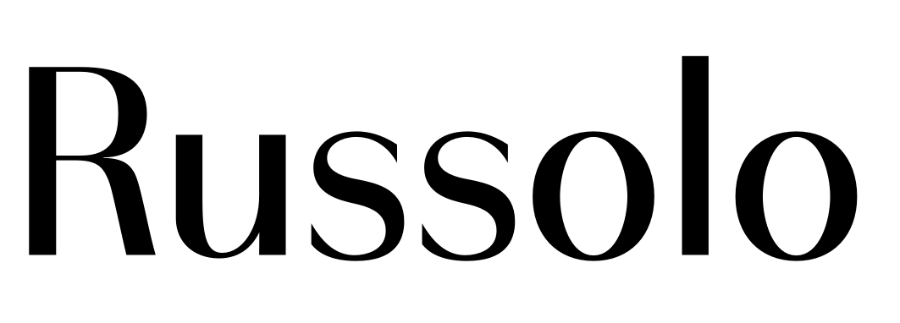
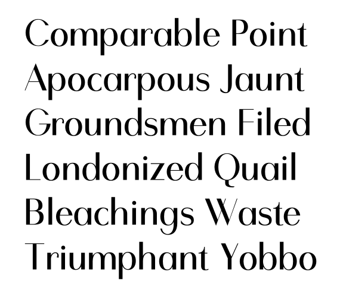

#### A typeface combining Bodoni and Futura into a high-contrast geometric sans

When I was a student at RIT in 2008-2010, I studied typography under the mentorship of Chuck Bigelow. I worked on a research project intended to find accurate revivals by comparing high-resolution scans of original prints to digitizations. Then it expanded to quantifying what the “average” typeface looked like from the main eras of typographic development by measuring various typefaces from those eras. Finally, I thought that it would be interesting to use my data to combine unique styles into something new (or at least interesting).

The most impressive prints I saw at that time were [Giambattista Bodoni's](https://en.wikipedia.org/wiki/Bodoni) (thank you David Pankow and RIT's Cary Collection). The text on those pages was solid, powerful, and modern. The fine hairlines made the letters seem like they grew out of the pages and were not placed on them. Meanwhile, I had admired the modernity and simplicity of Paul Renner's [Futura](https://en.wikipedia.org/wiki/Futura_(typeface)) for many years. It was only natural to me to try to bring these two great styles together.

[Luigi Russolo](https://en.wikipedia.org/wiki/Luigi_Russolo) was another great influence. He was not a typographer but a painter and composer largely known for a manifesto he published, [_The Art of Noises_](https://en.wikipedia.org/wiki/The_Art_of_Noises). He stated that, with the advent and growth of industrialization, humanity had discovered a new sonic palette. The sounds of machinery and electronics were everywhere and he thought that composers needed to include these timbres in their compositions through the usage of the very devices and machines that created them.

And so, Italian tradition meets the Futurist ideals of the 1910s-20s.

Development will include a character set matching Google Latin Plus and two axes: weight and stroke (which will add subtler contrast to stems as well as flared terminals on curved strokes).